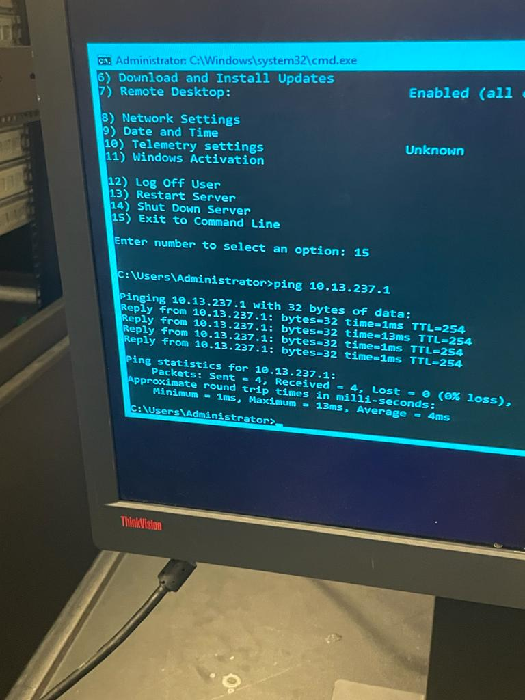
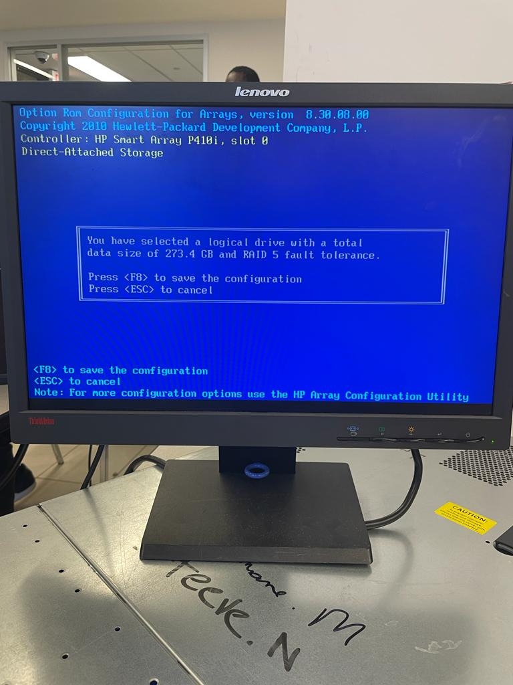
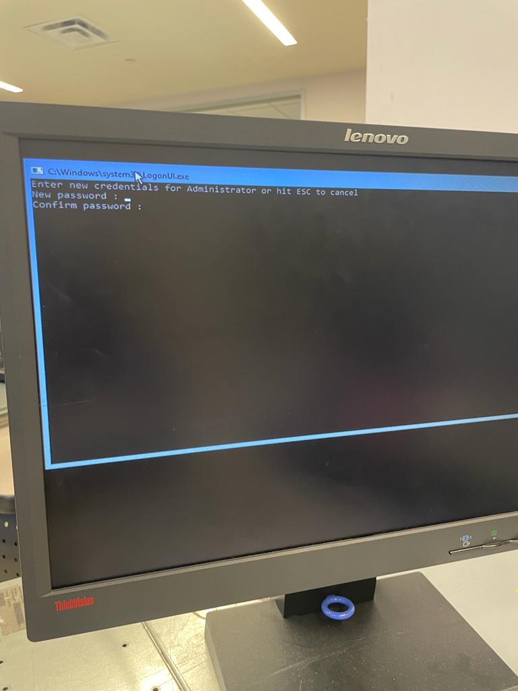
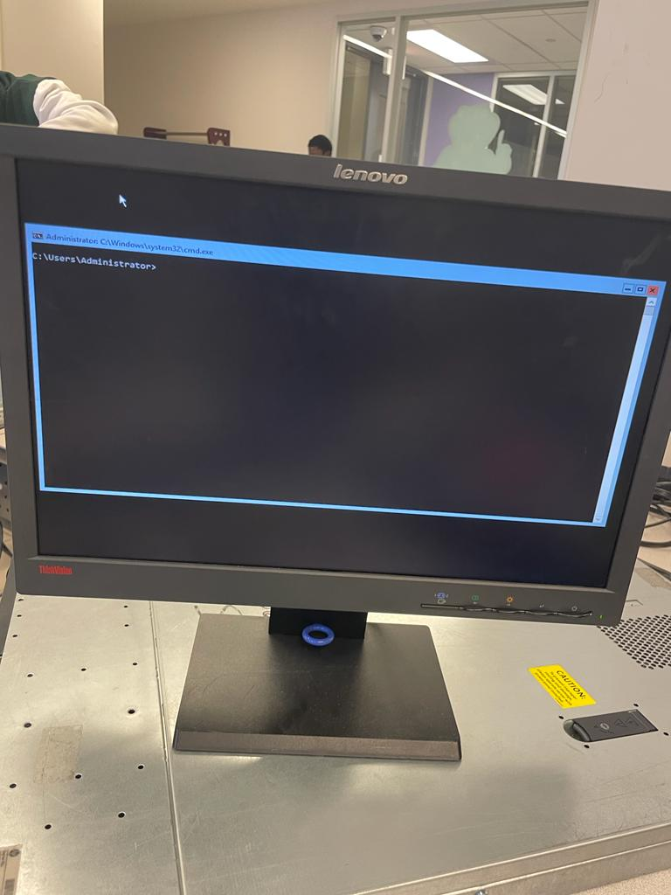
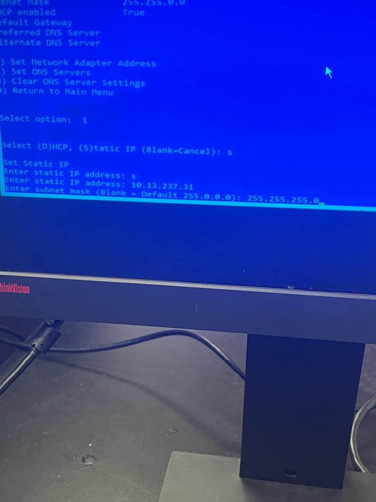

Bonjour Maiga

:whale: Installer windows

- [ ] Configuration du serveur

</img>  </img>

- [ ] debut d' installation du serveur

</img>  </img>

- [ ] installation du serveur 2

</img>  </img>

- [ ] installation windows

</img>  </img>

- [ ] installation windows

</img>  </img>

- [ ] installation windows

</img>  </img>

- [ ] installation windows

</img>  </img>

- [ ] installation windows

</img>  </img>

- [ ] installation du serveur

</img>  </img>

- [ ] debut d' installation du serveur

</img>  </img>

- [ ] installation du serveur

</img>  </img>

- [ ] configuration  du serveur

</img>  </img>

- [ ] configuration  du serveur

</img>  </img>

- [ ] configuration  du serveur

</img>  </img>

- [ ] configuration  du serveur

</img>  </img>

- [ ] configuration  du serveur

</img>  </img>

- [ ] configuration  du serveur

</img>  </img>

- [ ] configuration  du serveur

</img>  </img>

- [ ] configuration  du serveur

</img>  </img>

- [ ] configuration  du serveur

</img>  </img>

- [ ] configuration  du serveur

</img>  </img>

- [ ] configuration  du serveur

</img>  </img>

- [ ] configuration  du serveur

</img>  </img>

- [ ] configuration  du serveur

</img>  </img>

- [ ] configuration  du serveur

</img>  </img>

- [ ] configuration  du serveur

</img>  </img>

- [ ] configuration  du serveur

</img>  </img>

- [ ] configuration du serveur

</img>  </img>

- [ ] configuration du serveur

</img>  </img>

- [ ] configuration  du serveur

</img>  </img>

- [ ] configuration  du serveur

</img>  </img>

- [ ] installation du serveur

</img>  </img>

- [ ] installation du serveur

</img>  </img>

- [ ] installation du serveur

</img>  </img>
 
- [ ] installation du serveur

</img>  </img>

- [ ] installation du serveur

</img>  </img>

- [ ] installation du serveur

</img>  </img>

- [ ] installation du serveur

</img>  </img>

- [ ] installation du serveur

</img>  </img>

- [ ] installation du serveur

</img>  </img>
