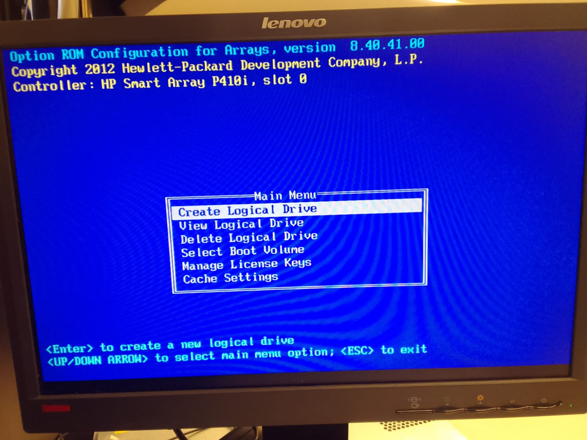
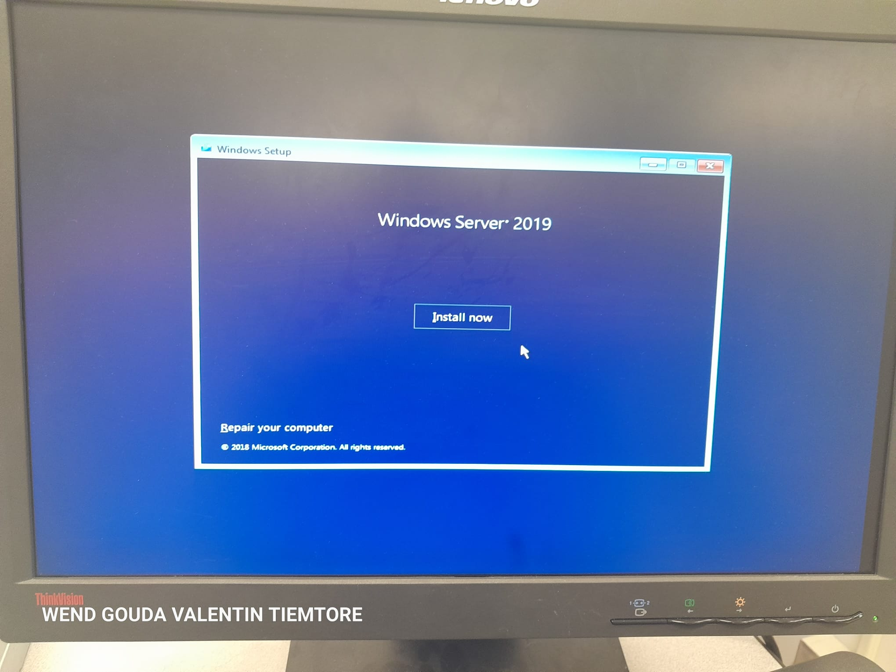
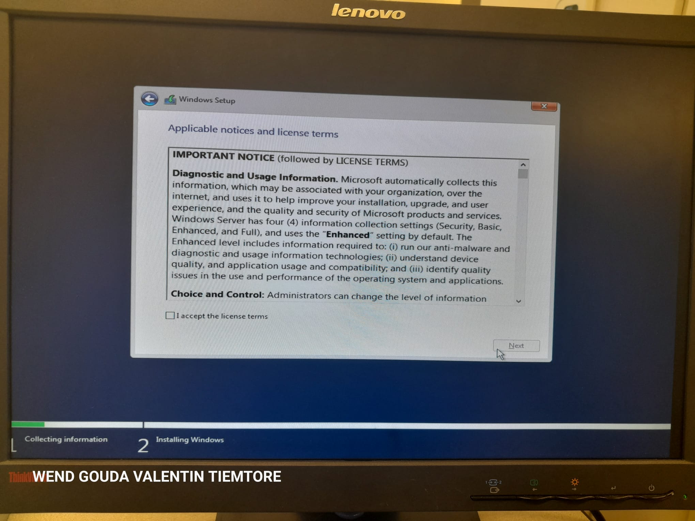
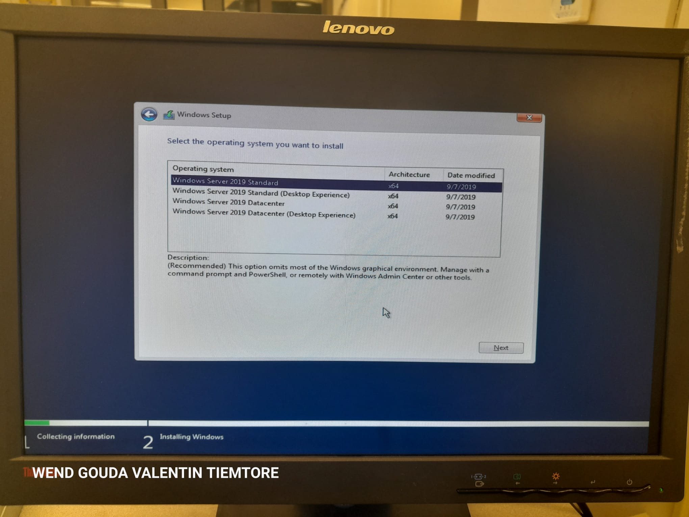
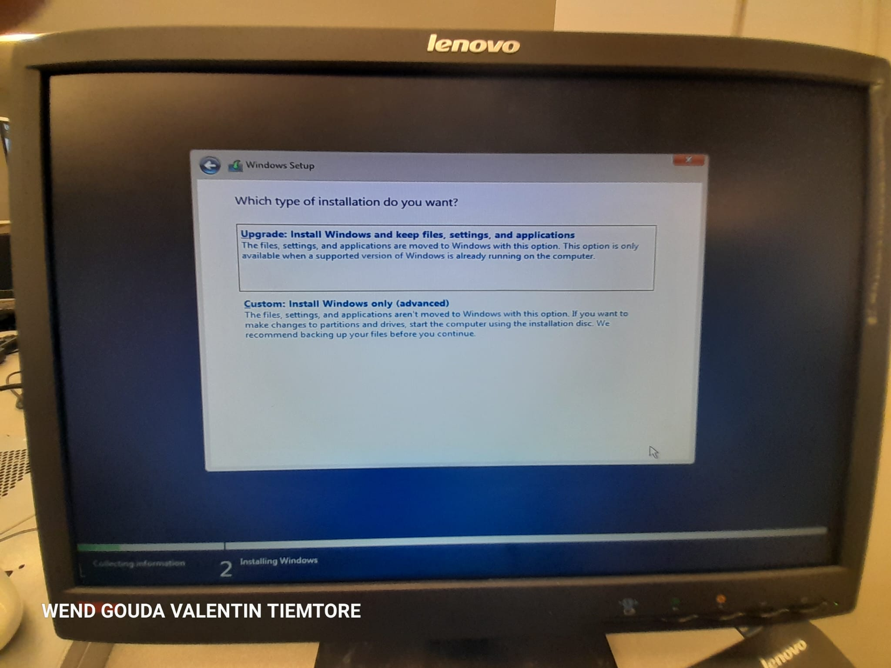
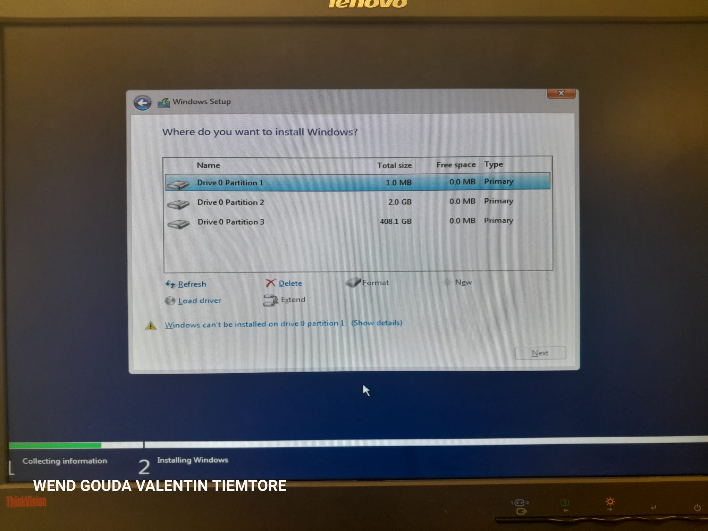

BIENVENUE A LA CONFIGURATION D'UN SERVEUR

LES PROCEDURES A SUIVRE

1-Desinstallation du systeme existant dans le serveur 

Pour ce faire,nous devons prepare le nouvel environnenment, c'est-a-dire que nous devons avoir une copie du systeme d'exploitation.
Ensuite inserer le disque d'installation sur le serveur. Redemarrer ensuite le serveur et assurons-nous qu'il demarre a partir du support d'installation.  

De prime a bord , nous allons suivre les instructions pour une desinstallation reussi

Dans le  Main Menu, nous allons creer Logical Drive puis on tape <Entrer>
Ceci va nous montrer une option de configuration par Arrays, mais nous allons selectionner <Bay 1> de la partie Physical Drives et <RAID 5> de la partie RAID Configurations  

 
Enfin nous venous de configurer le systeme, et nous entamons a l'installation du nouveau systeme.
 Alors l'installation du nouveau syteme est en marche.
  

 
 Suivons ces intructions pour une installation reussi
 
 
 
 
 
 
 
 
 
 
 
 
 
