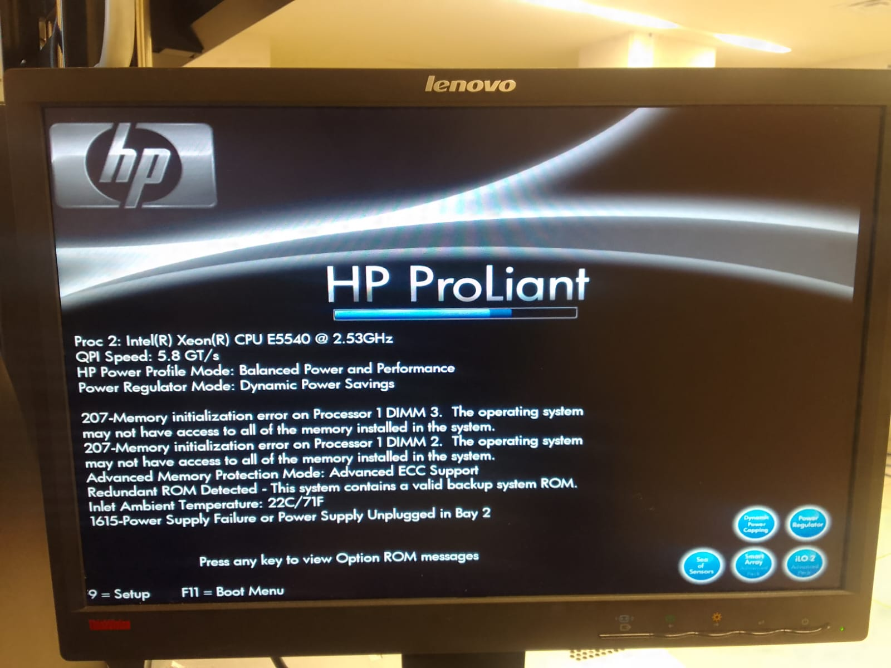
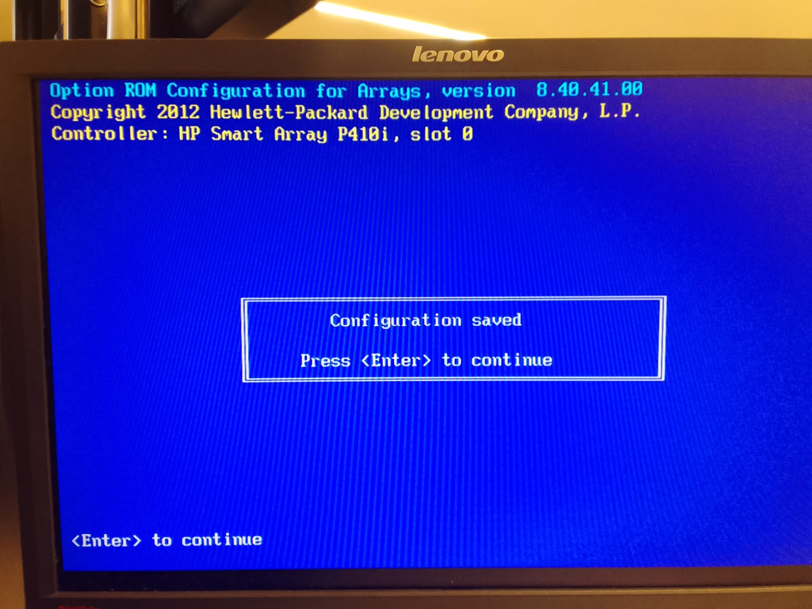

BIENVENUE A LA CONFIGURATION D'UN SERVEUR

LES PROCEDURES A SUIVRE

1-Desinstallation du systeme existant dans le serveur 

Pour ce faire,nous devons prepare le nouvel environnenment, c'est-a-dire que nous devons avoir une copie du systeme d'exploitation.
Ensuite inserer le disque d'installation sur le serveur. Redemarrer ensuite le serveur et assurons-nous qu'il demarre a partir du support d'installation.  

