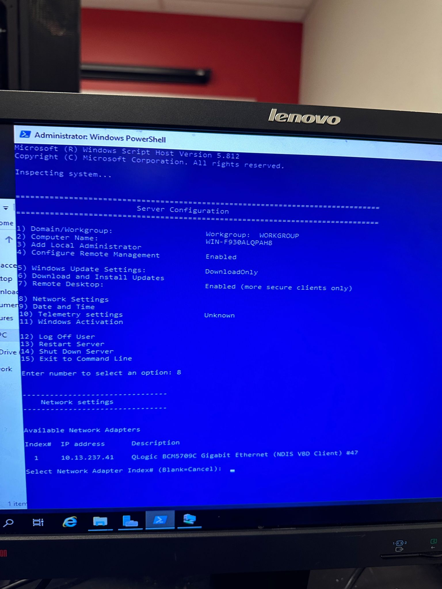
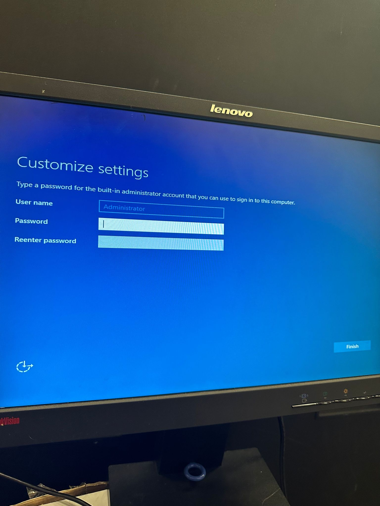
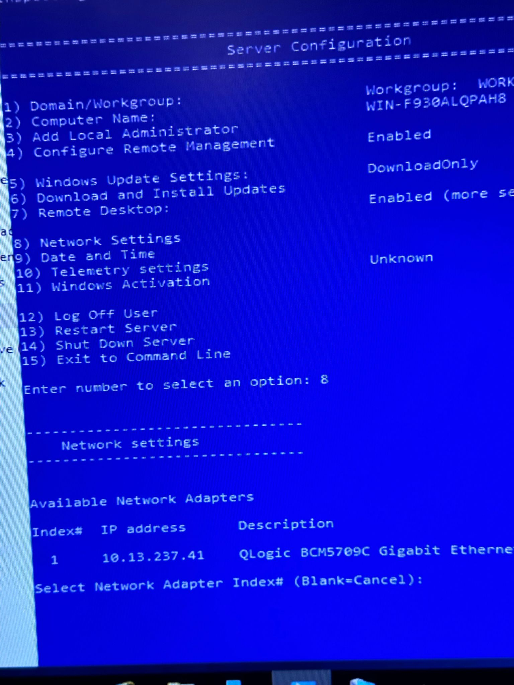

🏁 ETAPE DE CREATION ET D'INSTALLATION DE WINDOWS SERVER 2022 SUR UN SERVEUR 🏁

🚩Fait par: Reda Elyoussoufi🧑🏼‍💻

🏁 INSTALLATION DE WINDOWS SERVER 2019 SUR UN SERVEUR✅

 </img>

🏁 Mettre la cle du windows serveur

 </img>

🏁 Ajouter l'adresse IP au serveur

 </img>

🎰En conclusion, l'installation du système d'exploitation Windows Server sur un serveur constitue une étape essentielle pour mettre en place une infrastructure informatique robuste et performante. Tout au long de ce processus, nous avons pu constater l'importance de suivre les étapes avec précision et de se préparer adéquatement afin de garantir un déploiement réussi.

En choisissant Windows Server comme système d'exploitation, vous bénéficiez d'une plateforme fiable, sécurisée et évolutive, adaptée aux besoins des entreprises de toutes tailles. Cette solution offre une gamme complète de fonctionnalités, notamment la gestion des utilisateurs, le partage de fichiers, la virtualisation, la sécurité renforcée et bien plus encore.

L'installation du Windows Server exigeait une attention particulière lors de la sélection du bon média d'installation, des pilotes appropriés pour le matériel, ainsi que de la configuration des paramètres système et réseau. Nous espérons que notre guide complet vous a été utile pour naviguer avec succès à travers ces différentes étapes.

N'oubliez pas que l'administration d'un serveur est une tâche continue, et nous vous encourageons à maintenir le système à jour en appliquant les correctifs et les mises à jour de sécurité de manière régulière. En faisant preuve de vigilance et en mettant en place des pratiques de sauvegarde régulières, vous pouvez assurer la stabilité et la disponibilité de votre serveur sur le long terme.

Meilleures salutations❣️,
Reda Elyoussoufi
