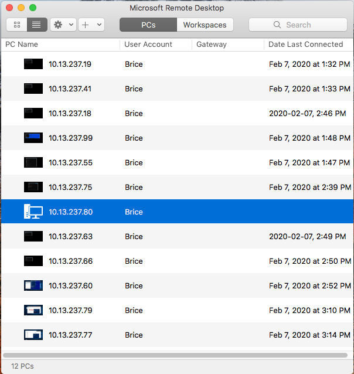

# Serveurs Windows

</img>
|:hash:| :id:      | Utilisateur à remplacer | Windows Product Name (Windows Server 2019)  | :key: OS Level | :whale: (opt)| 
|------|-----------|-------------------------|------------------------------------------------|----------|--------------|
| 01   | 300104524 | Brice@10.13.237.19      |:heavy_check_mark: Datacenter                   |:keyboard:|:heavy_check_mark:|
| 10   | 300112017 | Brice@10.13.237.60      |:heavy_check_mark: Datacenter         |  :desktop_computer:|:heavy_check_mark:|
| 0 | [300125413](../300125413/README.md)<image src='https://avatars0.githubusercontent.com/u/583231?s=460&v=4' width=20 height=20></image> | 
| 1 | [300130487](../300130487/README.md)<image src='https://avatars0.githubusercontent.com/u/133054165?s=460&v=4' width=20 height=20></image> |
| 2 | [300131438](../300131438/README.md)<image src='https://avatars0.githubusercontent.com/u/133056510?s=460&v=4' width=20 height=20></image> |
| 3 | [300130276](../300130276/README.md)<image src='https://avatars0.githubusercontent.com/u/122647527?s=460&v=4' width=20 height=20></image> |
| 4 | [300130347](../300130347/README.md)<image src='https://avatars0.githubusercontent.com/u/130868298?s=460&v=4' width=20 height=20></image> |
| 5 | [300132628](../300132628/README.md)<image src='https://avatars0.githubusercontent.com/u/133056557?s=460&v=4' width=20 height=20></image> |
| 6 | [300133791](../300133791/README.md)<image src='https://avatars0.githubusercontent.com/u/133054512?s=460&v=4' width=20 height=20></image> |
| 7 | [300133826](../300133826/README.md)<image src='https://avatars0.githubusercontent.com/u/133056364?s=460&v=4' width=20 height=20></image> |
| 8 | [300133896](../300133896/README.md)<image src='https://avatars0.githubusercontent.com/u/583231?s=460&v=4' width=20 height=20></image> |
| 9 | [300134460](../300134460/README.md)<image src='https://avatars0.githubusercontent.com/u/133164401?s=460&v=4' width=20 height=20></image> |
| 10 | [300134493](../300134493/README.md)<image src='https://avatars0.githubusercontent.com/u/133056541?s=460&v=4' width=20 height=20></image> |
| 11 | [300134647](../300134647/README.md)<image src='https://avatars0.githubusercontent.com/u/133054332?s=460&v=4' width=20 height=20></image> |
| 12 | [300135134](../300135134/README.md)<image src='https://avatars0.githubusercontent.com/u/133057032?s=460&v=4' width=20 height=20></image> |
| 13 | [300135175](../300135175/README.md)<image src='https://avatars0.githubusercontent.com/u/133053723?s=460&v=4' width=20 height=20></image> |
| 14 | [300135493](../300135493/README.md)<image src='https://avatars0.githubusercontent.com/u/131210227?s=460&v=4' width=20 height=20></image> |
| 15 | [300135538](../300135538/README.md)<image src='https://avatars0.githubusercontent.com/u/133056385?s=460&v=4' width=20 height=20></image> |
| 16 | [300135688](../300135688/README.md)<image src='https://avatars0.githubusercontent.com/u/133053743?s=460&v=4' width=20 height=20></image> |

# Vérification Prof

Sous @PowerShell

#### :one: Entrer la commande ci-dessous, 

* Taper Enter et Donner `B0r34l$` comme mot de passe

```powershell
$Password = Read-Host -AsSecureString 
```

#### :two: Créer l'utilisateur

```
PS > New-LocalUser "Brice" -Password $Password -FullName "Brice" -Description "Prof. "
```


#### :three: Donner les droits administrateurs à l'utilisateur

```
PS > Add-LocalGroupMember -Group "Administrators" -Member "Brice"
```

#### :four: Ne jamais faire expirer le mot de passe

```
PS> Set-LocalUser "Brice" -AccountNeverExpires
```

#### :x: Donner un autre mot de passe

```
PS > Set-LocalUser "Brice" -Password (ConvertTo-SecureString -AsPlainText "B0r34l$" -Force)
```

#### :o: Verification


```
PS > Get-LocalGroupMember -Group "Administrators"

ObjectClass Name                   PrincipalSource
----------- ----                   ---------------
User        <SERVEUR>\Administrator Local
User        <SERVEUR>\Brice         Local
```


### :key: OS Level

#### :keyboard: ServerCore 

```
PS > Get-ComputerInfo -Property WindowsProductName, OsServerLevel
WindowsProductName             OsServerLevel
------------------             -------------
Windows Server 2019 Datacenter    ServerCore
```
#### :desktop_computer: FullServer 

```
PS > Get-ComputerInfo -Property WindowsProductName, OsServerLevel

WindowsProductName             OsServerLevel
------------------             -------------
Windows Server 2019 Datacenter    FullServer
```

```
PS C:\> Get-ComputerInfo -Property Windows*, Hyper*


WindowsBuildLabEx                                 : 17763.1.amd64fre.rs5_release.180914-1434
WindowsCurrentVersion                             : 6.3
WindowsEditionId                                  : ServerDatacenterACor
WindowsInstallationType                           : Server Core
WindowsInstallDateFromRegistry                    : 1/11/2020 5:24:35 AM
WindowsProductId                                  : 00000-00000-00000-00000
WindowsProductName                                : Windows Server Datacenter
WindowsRegisteredOrganization                     :
WindowsRegisteredOwner                            :
WindowsSystemRoot                                 : C:\Windows
WindowsVersion                                    : 1809
HyperVisorPresent                                 : False
HyperVRequirementDataExecutionPreventionAvailable : True
HyperVRequirementSecondLevelAddressTranslation    : True
HyperVRequirementVirtualizationFirmwareEnabled    : True
HyperVRequirementVMMonitorModeExtensions          : True
```

### :whale: Docker Engine


# Références

https://pureinfotech.com/create-new-user-account-powershell-windows-10/
